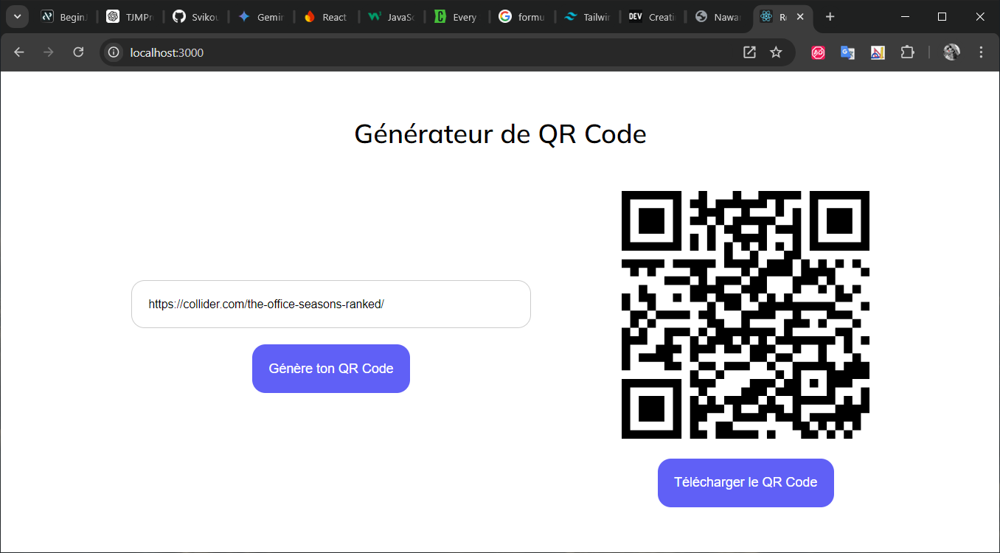

## QR Code Generator

**Description :** The QR Code Generator is a simple web application that allows users to easily generate QR codes from a given text or URL. This tool provides a user-friendly interface to input text or a URL, generate a QR code, display it, and download it as an image for use.

## Key Features:

• Input Field for Text or URL: Users can input any text or URL that they want to convert into a QR code.
• Generate QR Code Button: A button that triggers the generation of the QR code based on the user’s input.
• Display QR Code: Once the QR code is generated, it is displayed on the screen for the user to view.
• Download QR Code: Users can download the generated QR code as an image for future use.

## Screenshot 📸

## Technologies Used:

Frontend: React.js, tailwind css

## Skills Gained 🧠

• React.js: Familiarity with React functional components, useState for managing input data, and integrating third-party libraries.
• Dynamic Rendering: Handling dynamic rendering of elements, in this case, the QR code based on the user’s input.
• Event Handling: Managing button clicks to trigger actions (QR code generation and downloading).
• Image Download Functionality: Implementing functionality to allow users to download the QR code as an image.
